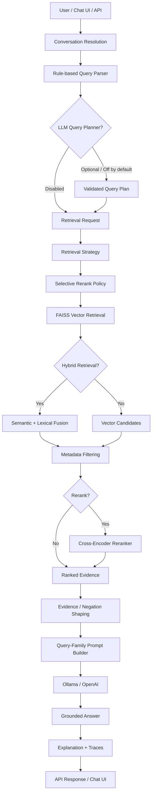
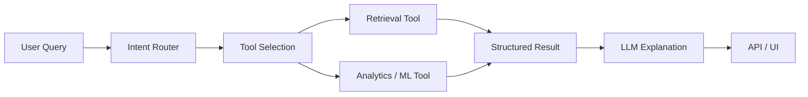

# LLM Retrieval Systems

A modular, observable **Retrieval-Augmented Generation (RAG) system** for building grounded LLM applications over domain-specific data.

The project goes beyond a basic vector-search demo. It implements an end-to-end pipeline for:

**query understanding → retrieval strategy → vector / hybrid retrieval → selective reranking → evidence shaping → grounded prompting → LLM generation → explainability → API / chat interaction**

The current implementation is demonstrated on **Amazon product reviews**, but the core retrieval, ranking, tracing, LLM, and API abstractions are designed as a reusable shell for other domains.

---

## What this project demonstrates

Most RAG examples stop at:

```text
Query → Vector Search → Prompt → LLM
```

This project focuses on the harder problems that appear once retrieval quality, answer quality, and system behavior need to be measured and controlled:

* How should different query types retrieve differently?
* When does hybrid search help?
* When does a cross-encoder reranker help — and when does it hurt?
* How should metadata filters interact with vector retrieval?
* How do we prevent irrelevant or negated evidence from entering the prompt?
* How should prompts change for different information needs?
* How can retrieval and generation decisions be inspected?
* How should short conversational follow-ups modify retrieval without introducing hidden state?
* Where can an LLM improve retrieval planning without taking control of the deterministic retrieval core?
* How do we evaluate the **complete RAG system**, rather than optimizing retrieval metrics in isolation?

The result is a local RAG architecture designed around **grounding, observability, controlled routing, and measurable system behavior**.

---

# System overview



Primary orchestration lives in:

```text
src/rag_pipeline.py
    RAGPipeline.answer()
```

HTTP and conversation-level orchestration lives in:

```text
src/api.py
    _run_query()
```

---

# Core capabilities

## 1. Structured query understanding

The system does not send the raw user question directly into vector search.

`QueryParser` first converts the question into a structured `RetrievalRequest` containing information such as:

* retrieval query text
* requested `top_k`
* metadata filters
* task type
* query family
* hybrid-search settings
* candidate-pool configuration
* reranking configuration

Current task types:

```text
general_qa
complaint_summary
```

Current query families include:

```text
abstract_complaint_summary
value_complaint
exact_issue_lookup
rating_scoped_summary
buyer_risk_issues
symptom_issue_extraction
unknown
```

The query family becomes an important control signal for retrieval strategy, reranking, and prompt construction.

---

## 2. Vector retrieval

The default embedding model is:

```text
sentence-transformers/all-MiniLM-L6-v2
```

An OpenAI embedding backend is also supported:

```text
text-embedding-3-small
```

Embeddings are normalized and indexed using:

```text
FAISS IndexFlatIP
```

With normalized vectors, inner-product search behaves as cosine similarity.

### Default retrieval configuration

```text
top_k = 5
oversample multiplier = 5
minimum candidate pool = 20
```

For a normal `top_k=5` request, the retriever typically fetches **25 vector candidates** before later ranking and filtering stages.

The candidate pool can grow further depending on query type and reranking configuration.

---

## 3. Metadata-aware retrieval

Structured filters can constrain the retrieved evidence.

Examples include:

```text
review_rating == 1
review_rating <= 3
brand == ...
```

Examples of parser behavior:

```text
"one-star reviews"
    → review_rating == 1

"negative reviews"
"low-rated reviews"
    → review_rating <= 3
```

Metadata filtering currently happens **after vector candidate retrieval**.

This architecture makes retrieval behavior easy to inspect, although it also means a finite candidate pool can underfill after filtering — one of the areas tracked for future improvement.

---

## 4. Hybrid semantic + lexical retrieval

Some query types benefit from exact lexical signals that pure embeddings may dilute.

The system therefore supports optional hybrid scoring over vector candidates.

A simple lexical score measures distinct query-token overlap with the document.

Semantic and lexical scores are independently normalized and combined as:

```text
hybrid_score =
    alpha * normalized_semantic_score
    +
    beta * normalized_lexical_score
```

Default weights:

```text
semantic = 0.7
lexical  = 0.3
```

The retrieval strategy can change these weights depending on the query.

For example:

```text
exact issue lookup
    → 0.6 semantic / 0.4 lexical

complaint-oriented queries
    → 0.85 semantic / 0.15 lexical

broad summaries
    → vector-only retrieval
```

This makes retrieval **task-aware rather than globally configured**.

---

# Selective reranking

The system supports second-stage cross-encoder reranking through a reusable reranker abstraction.

Default model:

```text
cross-encoder/ms-marco-MiniLM-L-6-v2
```

Other evaluated models include:

```text
cross-encoder/ms-marco-MiniLM-L-12-v2
cross-encoder/ms-marco-electra-base
```

Default reranking candidate size:

```text
top_n = 12
```

## Why reranking is selective

One of the main findings from this project is that **reranking is not automatically beneficial for every query**.

The current policy reranks broader semantic tasks while skipping narrow queries where first-stage retrieval already carries strong intent.

### Rerank enabled

```text
abstract_complaint_summary
value_complaint
buyer_risk_issues
```

### Rerank disabled

```text
rating_scoped_summary
exact_issue_lookup
symptom_issue_extraction
```

Rating-filtered queries also skip reranking.

The goal is not:

> Always use the most sophisticated ranking model.

It is:

> Use the additional ranking stage only when evaluation shows that the query type benefits from it.

---

# Retrieval evaluation

The repository contains a labeled retrieval evaluation set with **12 queries** and gold chunk identifiers.

At `k=5`, checked-in evaluation artifacts report:

| Retrieval strategy       | Precision@5 |  Recall@5 |   MRR |
| ------------------------ | ----------: | --------: | ----: |
| Vector                   |       0.233 |     0.639 | 0.642 |
| Hybrid                   |       0.267 |     0.708 | 0.771 |
| Always-on MiniLM rerank  |       0.233 |     0.653 | 0.667 |
| Selective MiniLM rerank  |       0.267 |     0.708 | 0.750 |
| Selective Electra rerank |   **0.283** | **0.750** | 0.767 |

These results illustrate an important system-level observation:

**a stronger ranking model is not necessarily a better global policy.**

Selective MiniLM reranking outperformed always-on MiniLM reranking on all three reported metrics.

Electra produced the strongest aggregate P@5 and Recall@5 in the current retrieval experiment, although performance varies by query family.

These numbers are **retrieval-level results**. They should not be interpreted as answer-quality improvements unless corresponding answer evaluation confirms the gain.

---

# Evidence-aware grounded generation

Retrieved evidence is not immediately passed to the LLM.

Before prompt construction, the system can perform additional evidence shaping.

For health/symptom-style queries, for example, `evidence_negation_filter.py` can remove excerpts whose primary signal is the **absence** of a symptom when the question is asking for reported problems.

This helps prevent evidence such as:

```text
"I did not experience a rash"
```

from being interpreted by the model as evidence of:

```text
"rash complaints"
```

The evidence-shaping layer is intentionally separate from vector retrieval and cross-encoder ranking.

---

# Task-aware prompting

`src/prompt_builder.py` builds prompts based on query family and task.

Current prompts enforce rules such as:

* answer only from retrieved evidence
* explicitly state when evidence is insufficient
* do not invent ratings, identifiers, dates, or quotes
* preserve deterministic metadata
* cite evidence using `Chunk N`
* do not invent medical diagnoses or unsupported causes
* distinguish symptom presence from symptom negation
* avoid survey-wide conclusions from a single review
* use multiple chunks when multiple relevant excerpts exist
* acknowledge conflicting evidence rather than silently resolving it

Different query families receive different reasoning and answer instructions.

Examples include:

* complaint summarization
* value complaints
* buyer risks
* rating-scoped summaries
* exact issue lookup
* symptom extraction

The current implementation intentionally exposes one future refactoring opportunity: **grounding rules, task framing, and output formatting currently live together inside the prompt layer.**

---

# LLM backends

Two generation backends are supported.

## Ollama

Default:

```text
model: llama3
endpoint: http://localhost:11434/api/generate
```

This allows the full application to run locally when the required models are available.

## OpenAI

Default:

```text
model: gpt-4o-mini
temperature: 0.2
```

Requires:

```text
OPENAI_API_KEY
```

The backend is abstracted behind the LLM interface rather than embedded directly inside the retrieval pipeline.

---

# Optional LLM query planner

Phase 5.5 adds an optional LLM-assisted retrieval planner:

```text
src/query_planner.py
```

It is **implemented but disabled by default**.

The planner does not replace the deterministic query parser.

Instead, the flow is:

```text
Rule parser
    ↓
Conversation overrides
    ↓
Optional LLM query planner
    ↓
Validation / allowlisting
    ↓
Retrieval strategy
```

The planner may propose a limited set of retrieval changes:

* normalized retrieval query text
* review-rating constraint
* allowlisted query family
* low-rating evidence requirement

It cannot create arbitrary metadata filters or arbitrary routing classes.

Invalid JSON, invalid values, or planner failures fall back to the deterministic request.

### Why it exists

Rule-based parsing is predictable, but continuously adding synonyms such as:

```text
worst
poor satisfaction
bad experience
low satisfaction
```

eventually becomes brittle.

The planner explores whether a small structured LLM call can normalize those requests without giving the LLM unrestricted control over retrieval.

### Current status

**Experimental / opt-in.**

The planner is implemented and tested structurally, but the checked-in evaluation does **not yet demonstrate answer-level improvement from enabling it**.

It therefore remains off by default.

---

# Grounded answer evaluation

Retrieval quality is necessary, but it is not the final product metric.

The repository also contains a **12-query manually scored answer evaluation**.

Answers are evaluated on a 1–3 scale for:

* groundedness
* correctness
* completeness

Latest Phase 4.5 results:

| Metric   |   Mean score |
| -------- | -----------: |
| Grounded | **3.00 / 3** |
| Correct  | **2.75 / 3** |
| Complete | **2.67 / 3** |

Current failure taxonomy:

```text
wrong_scope       = 2
weak_synthesis    = 2
hallucination     = 0
ignored_filter    = 0
```

Remaining weaknesses include:

* including non-complaint evidence in a complaint answer
* returning relevant evidence without sufficiently synthesizing frequency
* overly thin single-chunk synthesis
* treating neutral or positive mentions as negative issues

A core principle of the project is:

> A retrieval improvement is not complete until it improves answer quality or a clearly targeted failure class.

---

# Explainability and observability

The system exposes **pipeline reasoning**, not hidden model chain-of-thought.

With explanation enabled, the response can include:

### Evidence

The chunks that were actually supplied to the LLM prompt.

This is **context visibility**, not a claim that every returned chunk causally influenced the final answer.

### Reasoning summary

Structured system information such as:

* query family
* filters
* retrieval strategy
* hybrid mode
* reranking decision
* template
* retrieval counts
* relevant routing metadata

### Confidence

A heuristic confidence label based on observable pipeline state.

It considers signals such as:

* empty evidence
* thin evidence
* underfilled retrieval
* insufficient-evidence responses
* reranking state

Confidence is **not a calibrated probability** and should not be interpreted as one.

The current confidence system also does not perform full contradiction detection or independently verify whether every generated statement is supported by its cited evidence.

---

# Retrieval and answer traces

The system includes structured traces for debugging and evaluation.

Retrieval traces can capture:

* requested candidate count
* candidate pool
* post-filter count
* underfill
* missing-result count
* semantic / lexical / fused scores
* final ranking
* rerank decisions
* query family
* retrieval strategy
* gold-chunk membership during evaluation

Answer traces can capture:

* query
* routing
* template
* evidence chunk identifiers
* backend/model
* answer
* evaluation metadata

This allows failures to be classified as:

```text
retrieval failure
filtering failure
ranking failure
scope / routing failure
prompting failure
generation / synthesis failure
```

instead of treating every poor answer as an undifferentiated “LLM problem.”

---

# Conversational follow-ups

Phase 5.4 adds a bounded conversational layer without turning the retriever into a stateful chat system.

Conversation state is supplied by the client and limited to a small number of recent turns.

A turn can carry:

```text
raw user query
resolved query
query family
filters
answer summary
evidence chunk IDs
explain flag
```

The follow-up resolver supports several classes of interaction.

### Scope refinement

```text
"What about one-star reviews?"
"Only the negative ones."
```

### Aspect shift

```text
"What are the buyer risks?"
"What about value complaints?"
```

### Output refinement

```text
"Make that shorter."
"Give me bullet points."
"Top three only."
```

### Explanation requests

```text
"Why?"
"Which chunks support that?"
"How confident are you?"
```

The backend remains **stateless between requests**.

There is currently no:

* long-term memory
* cross-session user profile
* persistent chat database
* autonomous agent loop
* multi-agent orchestration
* long-horizon tool planning

The purpose of Phase 5.4 is narrow: make short follow-up interactions more natural while keeping retrieval behavior inspectable.

---

# API

The FastAPI layer exposes the RAG backend without coupling it to the frontend.

## Health

```http
GET /health
```

Response:

```json
{
  "status": "ok"
}
```

## Query

```http
POST /query
```

The request can configure options such as:

* query
* explain mode
* LLM backend/model
* top-k
* selective reranking
* reranker model / top-N
* bounded conversation context
* optional query planner

Successful responses use the top-level shape:

```json
{
  "answer": "...",
  "explanation": null,
  "metadata": {}
}
```

Errors use a stable wrapper:

```json
{
  "error": {
    "code": "...",
    "message": "...",
    "details": null
  }
}
```

Common categories include:

```text
invalid_request
backend_unavailable
pipeline_error
internal_error
```

See [API_CONTRACT.md](API_CONTRACT.md) for the detailed interface.

---

# Chat UI

A thin Streamlit client is included under:

```text
ui/
```

The UI communicates with the backend exclusively through the API.

It supports:

* normal Q&A
* explain mode
* evidence inspection
* confidence display
* routing metadata
* bounded follow-up context
* backend/model options
* selective reranking
* optional query planning

The frontend intentionally contains little retrieval intelligence; system behavior remains concentrated in `src/`.

---

# Project evolution

The system was built incrementally so that each stage addresses a concrete failure mode.

| Phase | Capability                                         | Status                    |
| ----- | -------------------------------------------------- | ------------------------- |
| Base  | Loading, chunking, embeddings, FAISS               | Implemented               |
| 1     | Structured query parsing                           | Implemented               |
| 2     | Retrieval diagnostics and traces                   | Implemented               |
| 3     | Hybrid retrieval and reranking                     | Implemented               |
| 3.5   | Selective reranking                                | Implemented + evaluated   |
| 4     | Grounded prompting and answer evaluation           | Implemented               |
| 4.4   | Parser / prompt discipline improvements            | Implemented + evaluated   |
| 4.5   | Buyer-risk / symptom routing and negation handling | Implemented + evaluated   |
| 5.1   | Explainable response envelope                      | Implemented               |
| 5.2   | FastAPI backend                                    | Implemented               |
| 5.3   | Streamlit chat UI                                  | Implemented               |
| 5.4   | Bounded conversational follow-ups                  | Implemented, limited v1   |
| 5.5   | Optional LLM retrieval planner                     | Implemented, experimental |
| 6     | Analytics / ML tools                               | **Planned**               |

For the detailed problem → change → measured impact history, see:

[**SYSTEM_EVOLUTION.md**](SYSTEM_EVOLUTION.md)

---

# Current limitations

This is currently a **local-development / portfolio architecture**, not a production service.

Important limitations include:

* evaluation sets are intentionally small
* the current raw review corpus and FAISS index are not checked into the repository
* metadata filtering occurs after finite candidate retrieval and does not currently backfill underfilled results
* parser coverage is still incomplete for some natural rating and brand expressions
* query-planner impact has not yet been demonstrated through answer-level evaluation
* heuristic confidence is not calibrated
* contradiction handling is prompt-based rather than model-verified
* conversation state is bounded and client-supplied
* dependencies and index/evaluation provenance are not yet fully pinned
* production authentication, persistence, streaming, monitoring, and deployment infrastructure are out of scope today

These constraints are intentionally documented rather than hidden because the project is also an exploration of **how retrieval systems fail and how those failures should be measured**.

---

# Future direction: retrieval + analytical tools

The next major architectural direction is **not** to make the LLM perform statistics inside prompts.

Phase 6 is planned around typed computational tools.

Target architecture:



Potential future analytical tools include:

* descriptive aggregations
* diagnostic analysis
* forecasting
* supervised prediction
* anomaly detection
* clustering / segmentation
* text analytics
* experimentation / causal inference
* optimization / decision support

The intended separation is:

```text
LLM
    → intent
    → routing
    → explanation

Tools
    → retrieval
    → numerical computation
    → statistics
    → ML inference
```

The current RAG pipeline would become a **Retrieval Tool** rather than being rewritten into a generic analytics engine.

See:

[**ML_CAPABILITIES_ROADMAP.md**](ML_CAPABILITIES_ROADMAP.md)

---

# Quick start

## 1. Install dependencies

```bash
pip install -r requirements.txt
```

If your environment exposes Python only as `python3`, use the corresponding `python3` commands below.

---

## 2. Add review data

The current demo expects an Amazon review CSV under the configured data path, currently:

```text
data/raw/amazon_com-product_reviews__20200101_20200331_sample.csv
```

The corpus itself is not included in the repository.

---

## 3. Build chunks

```bash
PYTHONPATH=. python scripts/build_chunks.py
```

---

## 4. Build the FAISS index

```bash
PYTHONPATH=. python scripts/build_index.py
```

---

## 5. Ask a question

```bash
PYTHONPATH=. python scripts/run_query.py --query "What are the most common product complaints?"
```

---

# Run the API

```bash
PYTHONPATH=. uvicorn src.api:app --host 127.0.0.1 --port 8000
```

OpenAPI documentation:

```text
http://127.0.0.1:8000/docs
```

---

# Run the chat UI

With the API running:

```bash
PYTHONPATH=. streamlit run ui/chat_ui.py
```

---

# Run evaluations

## Retrieval evaluation

```bash
PYTHONPATH=. python scripts/eval_retrieval.py
```

Labeled retrieval:

```bash
PYTHONPATH=. python scripts/eval_labeled_retrieval.py
```

Selective reranking:

```bash
PYTHONPATH=. python scripts/validate_selective_rerank.py --run-eval
```

Compare reranker models:

```bash
PYTHONPATH=. python scripts/compare_reranker_models.py
```

## Answer evaluation

```bash
PYTHONPATH=. python scripts/run_answer_eval.py
```

Summarize:

```bash
PYTHONPATH=. python scripts/summarize_answer_eval.py
```

---

# Repository structure

```text
llm-retrieval-systems/
│
├── src/
│   ├── rag_pipeline.py
│   ├── query_parser.py
│   ├── query_planner.py
│   ├── retrieval_request.py
│   ├── retrieval_strategy.py
│   ├── retriever.py
│   ├── hybrid_scoring.py
│   ├── metadata_filters.py
│   ├── rerank_policy.py
│   ├── reranker.py
│   ├── retrieval_with_rerank.py
│   ├── evidence_negation_filter.py
│   ├── prompt_builder.py
│   ├── explanation_builder.py
│   ├── followup_resolver.py
│   ├── conversation_state.py
│   ├── embeddings.py
│   ├── vector_store.py
│   ├── llm.py
│   ├── retrieval_trace.py
│   ├── answer_trace.py
│   └── api.py
│
├── ui/
│   └── Streamlit chat client
│
├── scripts/
│   └── build, query, evaluation, API and analysis utilities
│
├── eval/
│   └── retrieval and answer evaluation sets
│
├── artifacts/
│   └── retrieval traces, reranker comparisons and answer-eval results
│
├── tests/
│
├── SYSTEM_OVERVIEW.md
├── SYSTEM_EVOLUTION.md
├── PRODUCT_ROADMAP.md
├── ML_CAPABILITIES_ROADMAP.md
├── API_CONTRACT.md
├── RUN_GUIDE.md
└── DAILY_LOG.md
```

---

# Documentation

For deeper technical detail:

| Document                                                 | Purpose                                 |
| -------------------------------------------------------- | --------------------------------------- |
| [SYSTEM_OVERVIEW.md](SYSTEM_OVERVIEW.md)                 | Current architecture and data flow      |
| [SYSTEM_EVOLUTION.md](SYSTEM_EVOLUTION.md)               | Problem → solution → evaluation history |
| [PRODUCT_ROADMAP.md](PRODUCT_ROADMAP.md)                 | API, chat and product-layer evolution   |
| [ML_CAPABILITIES_ROADMAP.md](ML_CAPABILITIES_ROADMAP.md) | Future analytics / ML tool architecture |
| [API_CONTRACT.md](API_CONTRACT.md)                       | HTTP request / response contract        |
| [RUN_GUIDE.md](RUN_GUIDE.md)                             | Detailed run instructions               |
| [RUN_COMMANDS.md](RUN_COMMANDS.md)                       | Copy-paste command reference            |
| [DAILY_LOG.md](DAILY_LOG.md)                             | Append-only engineering change log      |

---

# Design principles

The project follows a few recurring principles:

**LLMs generate and interpret; deterministic components control retrieval.**

**A more sophisticated model is useful only when evaluation demonstrates value.**

**Retrieval metrics alone are not sufficient — answer quality is the product-level gate.**

**System reasoning should be observable without exposing hidden chain-of-thought.**

**Retrieval and future analytical computation should remain distinct but composable.**

**Failures should be classified by pipeline stage rather than blamed generically on the LLM.**

---

## Author

**Phani Pavuluri**
